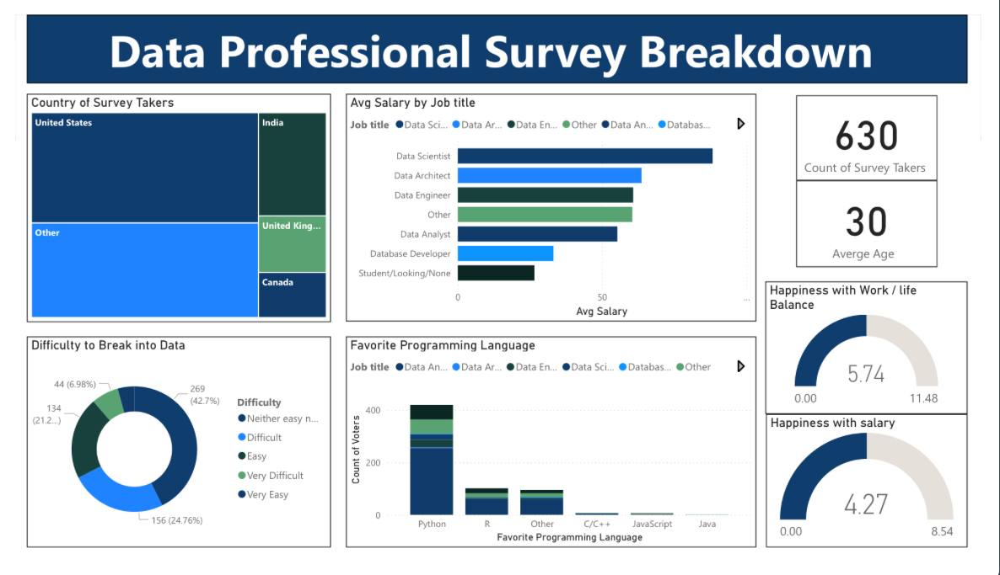

# 💼 Data Professional Survey Dashboard

A Power BI dashboard analyzing survey responses from data professionals worldwide.

--- 
## 🛠 Tools Used
- Power BI  
- Excel (data cleaning)  
- DAX
--- 
## 🎯 Objectives
- Explore salary trends by role and country  
- Identify the most used tools  
- Analyze satisfaction and work preferences
---
## 📊 Overview
- Count of survey takers : 630
- Country of survey takers : 5
- Average age : 30
---
## 🏆 Key Results 
- Highest average salary : Data Scientist
- Favorite Programming Language : Python
---
 
## 📸 Dashboard Preview

---

## 📂 Files
- (pbix / Power Bi File ) https://github.com/Muna5abdullah/Data-Professional-Survey-Dashboard/blob/main/Data-Professional-Survey.pbix 
- (pdf / Dashboard ) https://github.com/Muna5abdullah/Data-Professional-Survey-Dashboard/blob/main/Data-Professional-Survey.pdf
